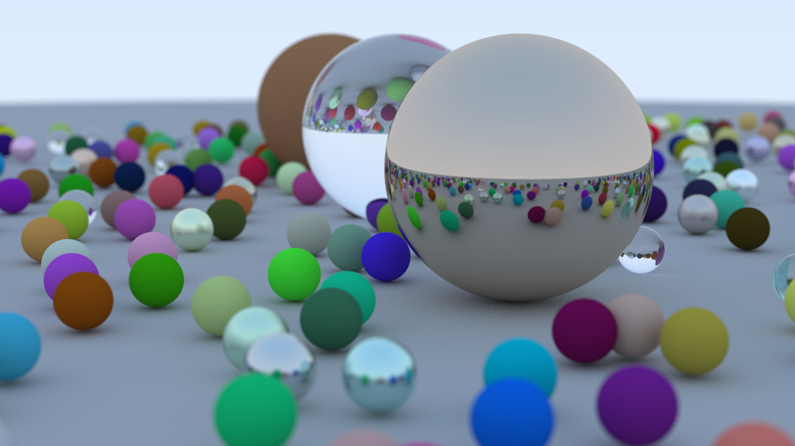
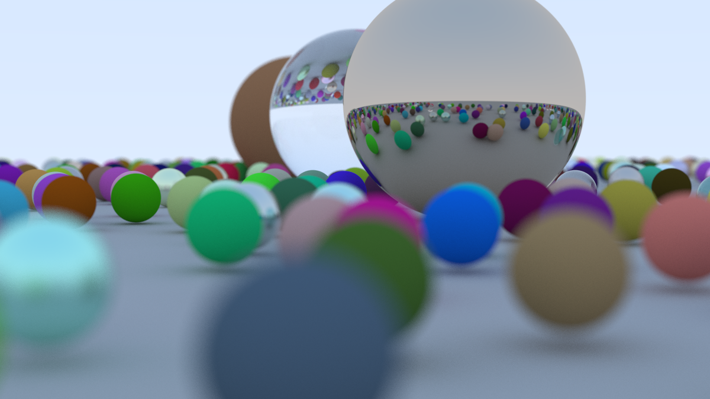

# ray-tracing-in-one-weekend-study-CUDA

`Ray Tracing in One Weekend` シリーズを読みながら実装した CPU 版レイトレーサーを、学習目的で少しずつ CUDA 化しているリポジトリです。

元の CPU 実装を一気に置き換えるのではなく、次のように段階的に GPU 側へ処理を移しています。

- CUDA Toolkit / `nvcc` を使ったビルド環境の準備
- C++ の `main.cpp` から CUDA 側の関数を呼び出す構成
- GPU で背景グラデーションを生成
- GPU で球 1 個との交差判定
- GPU で複数の球との交差判定
- GPU 側で Lambertian / Metal / Dielectric の簡易マテリアル処理
- GPU 側でランダムサンプリングと複数 bounce のパストレーシング
- GPU 側でカメラ設定、defocus blur、ランダムな多数の球を処理
- コピー元の最終シーンに近い構成で CPU 版と CUDA 版を比較

詳細な作業メモは `CUDA_SETUP_NOTES.md` にまとめています。

## 最終レンダリング結果

CUDA 版で、コピー元の最終シーンに近い構成を元のサンプル数相当でレンダリングしました。



### 計測結果

通常カメラ位置での CUDA 版フルレンダリング条件:

- 画像サイズ: `1200 x 675`
- Samples per pixel: `500`
- Max depth: `50`
- 球の数: `485`
- Total primary samples: `405,000,000`
- Camera: `lookfrom = (13, 2, 3)`, `lookat = (0, 0, 0)`, `vfov = 20`
- Defocus angle: `0.6`

計測結果:

- CUDA render time: `72.5343` 秒
- CUDA primary samples/sec: 約 `5.58M`

手元メモの CPU 版実行時間は `11時間42分` だったため、単純比較では約 `580倍` 高速でした。

## 別角度のレンダリング例

同じ解像度・同じサンプル数のまま、カメラを地面に近い位置まで下げてレンダリングした例です。



低いカメラ位置の条件:

- Camera: `lookfrom = (13, 0.6, 3)`, `lookat = (0, 0, 0)`, `vfov = 20`
- 画像サイズ: `1200 x 675`
- Samples per pixel: `500`
- Max depth: `50`
- CUDA render time: `58.1977` 秒

## ビルドと実行

この環境では Visual Studio 2026 Community と CUDA Toolkit 13.3 を使い、`NMake Makefiles` でビルドしています。

```powershell
cmd /c 'call "C:\Program Files\Microsoft Visual Studio\18\Community\Common7\Tools\VsDevCmd.bat" -arch=x64 && cmake -S . -B build_nmake_cuda -G "NMake Makefiles"'
```

```powershell
cmd /c 'call "C:\Program Files\Microsoft Visual Studio\18\Community\Common7\Tools\VsDevCmd.bat" -arch=x64 && cmake --build build_nmake_cuda'
```

```powershell
cmd /c 'call "C:\Program Files\Microsoft Visual Studio\18\Community\Common7\Tools\VsDevCmd.bat" -arch=x64 && build_nmake_cuda\inOneWeekend.exe'
```
